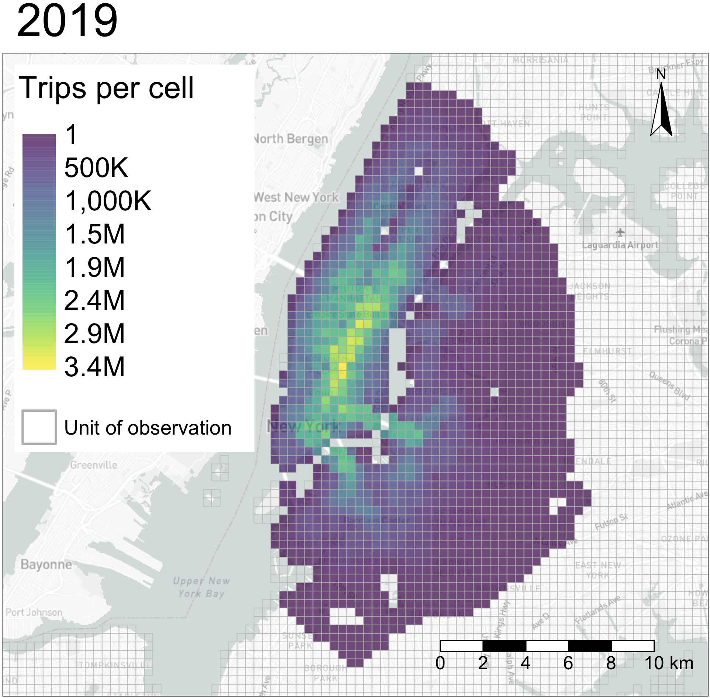
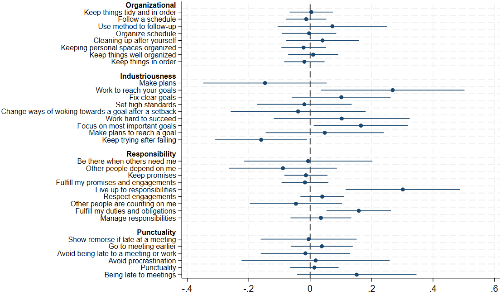
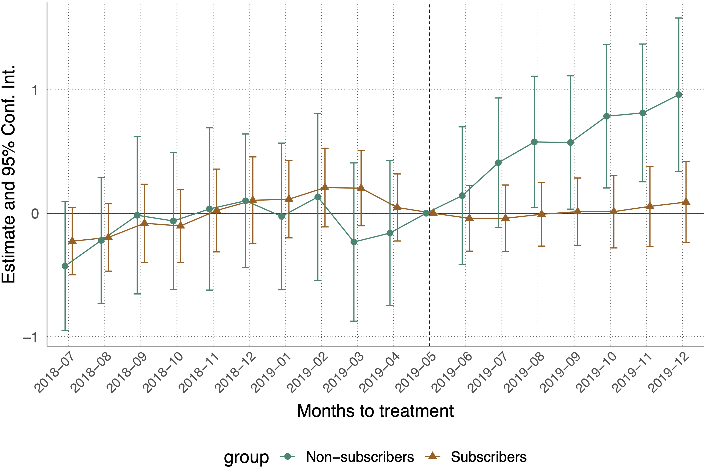
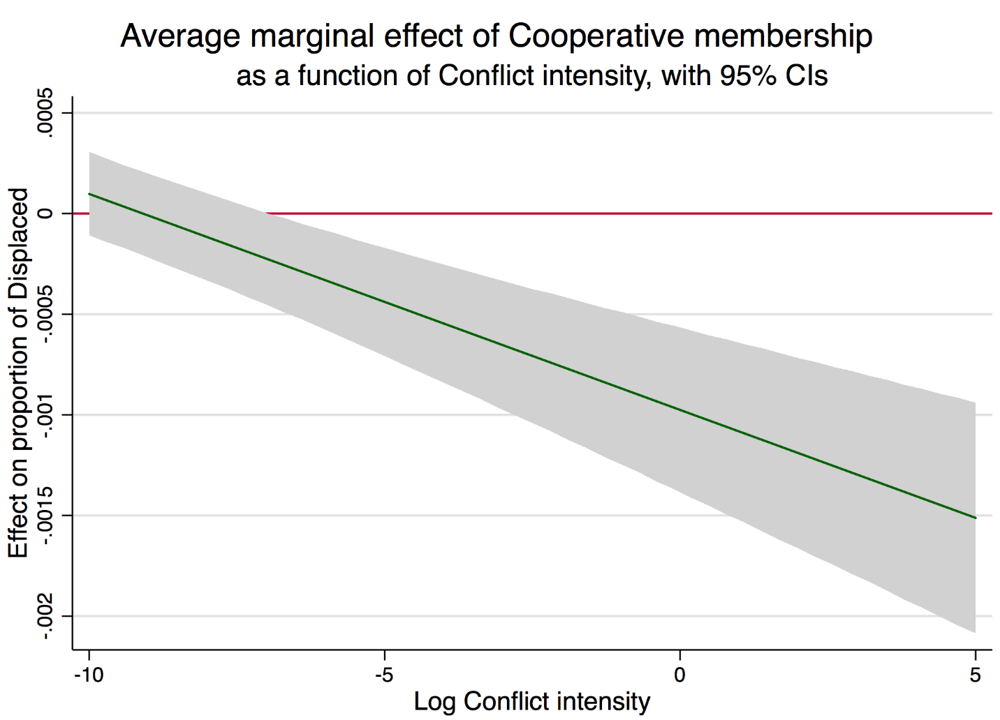

# {{ page.title }}

<!-- ## Job Market Paper
  -->

## Working papers

<b><a href="https://www.vinceth.net/assets/doc/thorne-jmp_cycling-cleaner_latest.pdf">Cycling Toward Cleaner Cities? Evidence from New York City's Bike Share Program</a></b> 
*Under review*

    

[Featured: <a href="https://www.parisschoolofeconomics.eu/app/uploads/2024/07/Bike-Share-Programs-and-Cleaner-Air-Insights-from-New-York-City.pdf"> PSE Policy Brief</a>]

What is the impact of cycling infrastructure on air quality in cities? This paper leverages the staggered rollout of New York City’s bike share program to estimate the effect of cycling infrastructure on air pollution concentrations. I combine the universe of bike share trips with ground-level, high-resolution observational air pollution measures between 2010 and 2019. Through a routing algorithm, I use the location of bike share stations to map areas where road traffic is expected to decrease after the introduction of bike share. I compare these areas with others where traffic was likely unaffected using a staggered difference-in-differences strategy to retrieve causal estimates. I find that the deployment of bike share is associated with a 3% reduction in black carbon and 13% reduction in nitric oxide concentrations, both pollutants associated with road traffic. Back-of-the-envelope valuation of the health and mortality benefits associated with the reduction in nitric oxide concentrations suggests that bike share prevented up to $327 million in social damages. In addition, I investigate potential mechanisms and show that the introduction of bike share is associated with a decrease in short taxi trips in areas served by bike share, which I interpret as suggestive evidence that bike share substitutes road traffic.
{: .fs-3 }

 
<b><a href="https://doi.org/10.1596/1813-9450-10378">Conscientiousness and labor market returns: Evidence from a field experiment in Senegal</a></b> 
(with <a href="https://www.psychology.uzh.ch/en/areas/dev/diffges/team/allemand.html">Mathias Allemand</a>, <a href="https://sites.google.com/site/mkirchberger/home">Martina Kirchberger</a>, <a href="https://www.svetamilusheva.com/">Sveta Milusheva</a>, <a href="https://www.carolnewman.ie/">Carol Newman</a>, and <a href="https://psychology.illinois.edu/directory/profile/bwrobrts">Brent Roberts</a>) 
Policy Research Working Paper 1010378 
*Revise and resubmit, ReStat*

    

[Featured: [World Bank Blogs](https://blogs.worldbank.org/en/developmenttalk/-show-up-on-time-and-you-will-get-a-raise---labor-market-impacts)]

Non-cognitive skills are increasingly recognized as important determinants of labor market outcomes. To what extent these skills can be affected in adulthood remains an open question. We conducted a randomized controlled trial with low-skilled employed workers in Senegal where workers were randomly assigned to receive a training intervention designed to affect conscientiousness traits. We found that treated workers were significantly more likely to stay in their job and have higher wages nine months after the intervention. Our findings suggest that non-cognitive skills can be affected even later in the life cycle and can have substantial labor market returns.
{: .fs-3 }

## Work in progress
 
<b>Can Apps Save the Planet? Enhancing Urban Mobility and the Environment through Tech Adoption</b> 
(with [Michael Guzzardi](https://www.linkedin.com/in/michael-guzzardi-963b64a4/), <a href="https://sites.google.com/site/sefijroth/home">Sefi Roth</a>, and <a href="https://www.lse.ac.uk/geography-and-environment/people/academic-staff/hendrik-wolff">Hendrik Wolff</a>)

    

This paper investigates the impact of integrating bike-sharing services into a major transportation mobile app on ridership in New York City. Specifically, it examines the effect of Lyft’s acquisition of Motivate (a bike-share company) and the subsequent inclusion of their bike-sharing services in the Lyft app. Using a rich dataset from the Indego and Citi Bike systems, the study employs difference in differences and triple-difference estimators to compare ridership in New York City and Philadelphia, before and after the integration, among subscriber and non-subscriber groups. The results show a 12 percent overall increase in ridership in New York City, driven entirely by non-subscribers (marginal users), which increased usage by a staggering 79 percent. The findings contribute to the literature on public bicycle usage and technological adoption, highlighting the importance of ease-of-use features in promoting sustainable urban transit and the provision of information. Additionally, the study offers insights into the benefits of integrating different mobility (or other) services into a single platform, supporting the concept of Mobility as a Service (MaaS) in this context. Finally, our results provide valuable information for city planners and policymakers on how to promote cycling, which has the potential to significantly reduce congestion, local air pollution concentrations, and carbon emissions.
{: .fs-3 }

<b>Constructing Africa’s Cities: Measuring and Enhancing Construction Worker Welfare in Dakar</b> 
(with <a href="https://sites.google.com/site/mkirchberger/home">Martina Kirchberger</a>, <a href="https://www.svetamilusheva.com/">Sveta Milusheva</a>, and <a href="https://www.carolnewman.ie/">Carol Newman</a>)

<b>How Does Carpooling Impact Private Car Usage And Ownership?</b> 
(with [Nicolas Astier](https://sites.google.com/view/nicolas-astier?authuser=2), [Paul Dutronc-Postel](https://pzuldp.github.io/pdp.io/), [Clément Malgouyres](https://sites.google.com/site/clementmalgouyres/))

<b>Female Labour Force Participation and Urban Transit: Evidence from the Washington Metro</b> 
(with [Maximilian Günnewig-Mönert](https://mguennewigmoenert.github.io/))

## Other work
 
<b><a href="/docs/research/assets/coop-colombia/coop-colombia.pdf">Sticking Together: The impact of cooperatives on forced displacement in Colombia</a></b> 
(MSc Thesis, Universitat de Barcelona, 2018. Supervisor: Prof. <a href= "https://ideas.repec.org/e/plo11.html">Enrique López-Bazo</a>)

    

[<a href="datasets_do.html#sticking-together-the-impact-of-cooperatives-on-forced-displacement-in-colombia">Data sets and scripts</a>]

I investigate the impact of the presence of cooperatives on forced displacement due to the conflict in Colombia. I postulate that integrative firm structures make individuals and their households more resilient to conflict consequences, thus lowering displacement due to conflict violence in municipalities with higher cooperative presence. I use extensive governmental data on Colombian cooperatives, displacement and a set of controls, all on the municipal level from 2003 to 2013. Zero-inflated beta models are employed to account for features of the dependent variable (a fraction with an excess of zeros). Results suggest that the number of cooperative membership rate is a significant (negative) predictor of the rate of displaced people, and these estimates are robust to a number of alternative specifications. These results support the case for the social and solidarity economy in unstable countries, as they seem to provide communities with resilience to violent contexts.
{: .fs-3 }