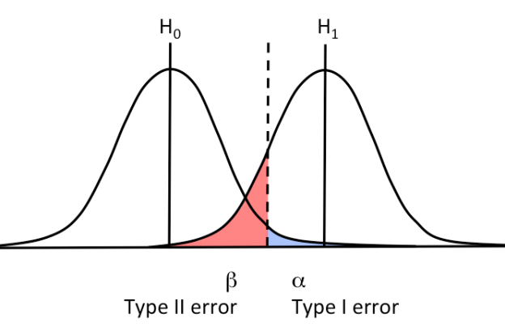

# Tutorial 8 — C9
{: .no_toc }

1. TOC
{:toc}

## Null hypothesis and alternative hypothesis

- Null hypothesis, $H_0$: presumed default state of nature or status quo. In specifying $H_0$, always contains an equality, i.e. $H_0 =$ or $H_0 \leq$ or $H_0 \geq$.

- Alternative hypothesis, $H_A$: a contradiction of the default state of nature or status quo. Usually, $H_A$ is the outcome we want to test, the "desired" outcome.

We use sample information to infere unknown population parameters. We do hypothesis testing: we determine whether the evidence from the sample contradicts $H_0$.

Outcomes:

- Reject $H_0$: sample evidence *inconsistent* with $H_0$
- Do not reject $H_0$: evidence *not* inconsistent with $H_0$

Importantly, we can *never accept* $H_0$.

- Two-tails: $H_0: \mu = \mu_0$vs $H_A: \mu \neq \mu_0$. If we use $\neq$, we say that both tails matter in order to assess $H_0$. Interpretation of the test: "Has no impact".
- One-tail: $H_0: \mu \leq \mu_0$vs $H_A: \mu > \mu_0$. Interpretation of the test: "Does not increase". Look at the sign of $H_A$ to assess which tail to use.

Porcedure

1. Identify the relevant population parameter of interest. 
2. Determine whether it is a one or a two-tailed test. 
3. Include some form of the equality sign in $H_0$ and use $H_A$ to establish a claim.

## Hypothesis test using CIs

Decision rule

- Reject $H_0$ if the CI *does not contain* the value of $H_0=\mu_0$
- Do not reject $H_0$ if CI *does contain* the value of $H_0 = \mu_0$

## Hypothesis test using the p-value

Assume $H_0$ is true and see if sample evidence contradicts it.

The p-value is the likelihood of obtaining a sample statistic at least as extreme as the one in the sample, under the assumption that $H_0$ is true.

If the null hypothesis is true, how likely is that I have a sample at least as extreme as the one I have? 

- Caluclate the test statistic of your sample.
- Check what is the area associatied with this $z$
- Check if the are is greater (or smaller, depending on the specification of your test) than the area associated with the significance level you choose.

The p-value tells you the probability that this sample result would be generated if $H_0$ was true. Small *p*-value = small probability the null is true 

## Hypothesis test using the critical value

Reject the null hypothesis if the z-score is greater than some critical value.

- Standardize the sample mean using the sample formula. This is your *test statistic*.
- Check if it's greater (or smaller, depending on the type of test) than the $z_{\alpha/2}$ with significance level $\alpha$.

## Test statistics for the poplation mean

Same "brick" of formula that you used to compute CI.

Not in the formula sheet! $ \frac{\bar{x}-\mu_0}{\sigma/\sqrt{n}} $ or $ \frac{\bar{x}-\mu_0}{s/\sqrt{n-1}} $ if $\sigma$ unknown.

## Test statistics for the population proportion

Not in the formula sheet! $ \frac{\bar{p}-p_0}{\sqrt{\frac{p_0(1-p_0)}{n}}} $

## Type I and Type II errors

- Type I: $H_0$ is true but we believe in $H_A$ (i.e. we don't believe in $H_0$).
- Type II: $H_0$ is *not* true but we believe in $H_0$ (i.e. we don't believe in $H_A$).

- Type I: we *reject* $H_0$ when $H_0$ is *true*.
- Type II: we *fail* to reject $H_0$ when $H_0$ is *false*.

- Type I: measured by $\alpha$, significance level
- Type II: measured by $\beta$, power of the test.

Both depend of the standard error.

|                         |                    $H_0$ true                    |                 $H_0$ not true                 |
| ----------------------- | :----------------------------------------------: | :--------------------------------------------: |
| **Reject $H_0$**        |  Type I error False positive $\alpha$  |   Correct decision Power $1-\beta$   |
| **Do not reject $H_0$** | Correct decision Confidence $1-\alpha$ | Type II error False negative $\beta$ |

A decrease in $\alpha$ will increase $\beta$.

If the null hypothesis is "not pregnant", the following show type I and II error.

